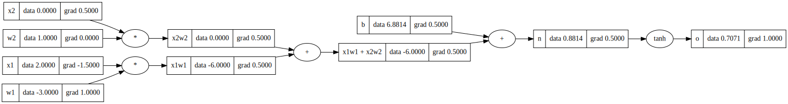

# Micrograd

A small autograd (automatic differentiation) engine, built by following Andrej Karpathy's [tutorial](https://www.youtube.com/watch?v=VMj-3S1tku0).

As an extension, I have added

-   A script to train a micrograd neural network
-   A Notebook where I verify that micrograd yield the same results as pytorch for prediction, loss and gradient calculation

## Training

To train a micrograd neural network on the XOR function, run `python3 train.py`

## Verfication

A step-by-step walkthrough comparing micrograd and pytorch outputs for prediction, loss and gradients is provided in `verification.ipynb`

## Example

An example of a computational graph for the expression `tanh(x1*w1 + x2*w2 + b)` with data and gradients calculated created by micrograd:

